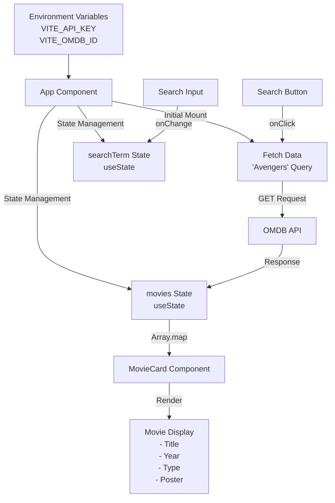

# MovieLand - Movie Search Application

A comprehensive React-based movie search application leveraging the OMDB API to provide users with an intuitive interface for discovering movies.

## Features

- Dynamic movie search with real-time results
- Responsive grid layout for movie cards
- Detailed movie information display
  - Movie title, year, and type
  - High-quality poster images
  - Fallback image handling for missing posters
- Initial showcase of Avengers movies
- Error handling for API requests
- Loading states and user feedback
- Mobile-responsive design

## Tech Stack

- React 19 with Hooks
- Vite for build tooling
- OMDB API integration
- ESLint + Prettier for code quality
- CSS3 with Flexbox/Grid
- Environment variable management

## Data Flow Architecture



### Data Flow Description

1. **Environment Setup**

   - Environment variables loaded at startup
   - API configuration initialized

2. **Component Lifecycle**

   - Initial mount triggers 'Avengers' search
   - State management using React hooks
   - Efficient re-rendering optimization

3. **User Interaction Flow**
   - Search input updates state
   - Debounced API calls for performance
   - Real-time feedback to user actions

## Prerequisites

- Node.js (v18 or higher)
- Bun package manager
- OMDB API credentials
- Modern web browser with JavaScript enabled

## Environment Configuration

Create a `.env` file in the project root:

```env
VITE_API_KEY=your_omdb_api_key
VITE_OMDB_ID=your_omdb_id
```

## Installation & Setup

1. Clone the repository:

```bash
git clone [repository-url]
cd movie-app
```

2. Install dependencies:

```bash
bun install
# or
npm install
```

3. Start development server:

```bash
bun run dev
# or
npm run dev
```

## Project Structure

```
movie-app/
├── src/
│   ├── components/
│   │   ├── MovieCard/
│   │   │   ├── MovieCard.jsx
│   │   │   └── MovieCard.css
│   │   └── SearchBar/
│   │       ├── SearchBar.jsx
│   │       └── SearchBar.css
│   ├── utils/
│   │   ├── api.js
│   │   └── helpers.js
│   ├── App.jsx
│   ├── App.css
│   └── main.jsx
├── public/
│   └── assets/
├── tests/
├── .env
├── package.json
└── README.md
```

## API Integration Details

### OMDB API Usage

```javascript
const searchMovies = async (title) => {
  const response = await fetch(`${API_URL}&s=${title}`);
  const data = await response.json();
  return data.Search;
};
```

## Available Scripts

- `bun run dev` - Launch development server
- `bun run build` - Create production build
- `bun run lint` - Run ESLint checks
- `bun run test` - Execute test suite
- `bun run preview` - Preview production build

## Performance Optimization

- Lazy loading for images
- Debounced search inputs
- Memoized components
- Efficient state updates

## Error Handling

- API request failure handling
- Invalid movie data handling
- Network error management
- User input validation

## Contributing

1. Fork the repository
2. Create feature branch (`git checkout -b feature/AmazingFeature`)
3. Commit changes (`git commit -m 'Add AmazingFeature'`)
4. Push to branch (`git push origin feature/AmazingFeature`)
5. Open Pull Request

## License

This project is licensed under the ISC License - see the [LICENSE](LICENSE) file for details.

## Acknowledgments

- OMDB API for movie data
- React team for excellent documentation
- Open source community for inspiration

## Support

For support, email support@movieland.com or open an issue in the repository.
