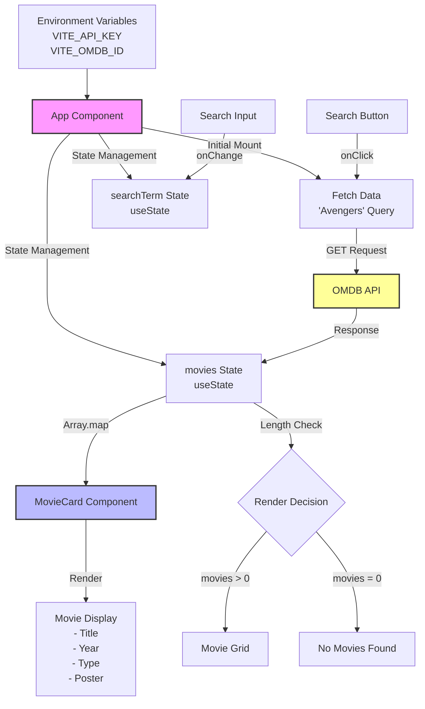

# MovieLand Data Flow Diagram

## Data Flow Description

1. **Environment Setup**
   - Environment variables (API_KEY and OMDB_ID) are loaded into the App component

2. **Initial Load**
   - App component mounts
   - Triggers fetch with 'Avengers' as initial search
   - Data is stored in movies state

3. **User Interaction**
   - User types in search box → Updates searchTerm state
   - User clicks search → Triggers new API fetch

4. **Data Fetching**
   - Fetch request sent to OMDB API
   - Response processed and stored in movies state

5. **Rendering**
   - Movies state determines render output
   - If movies exist → Render grid of MovieCard components
   - If no movies → Render empty state message

6. **MovieCard Component**
   - Receives movie data as props
   - Renders individual movie information
   - Handles missing poster images with fallback
